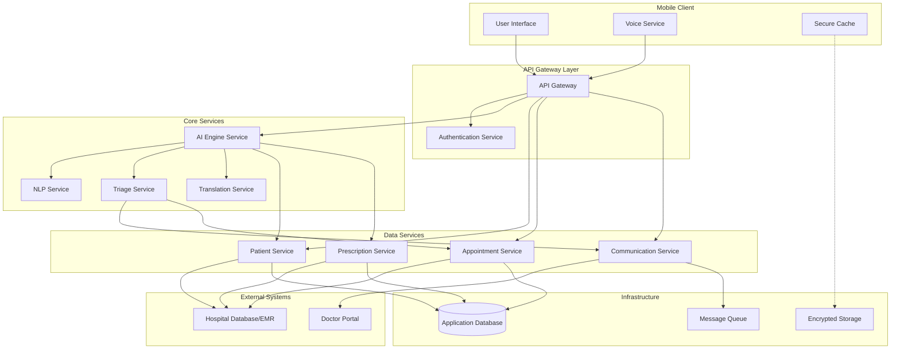

# Design Document: Medical Patient Support App

## Overview

The Medical Patient Support App is a mobile healthcare application that provides AI-powered, tiered medical support to hospital-registered patients. The system architecture consists of a mobile client application, a cloud-based AI engine with natural language processing capabilities, a secure backend API layer, and integration with hospital Electronic Medical Record (EMR) systems.

The design emphasizes three core principles:
1. **Privacy-First Architecture**: All patient data is encrypted in transit and at rest, with strict access controls
2. **Tiered Intelligence**: Three distinct support levels (General Awareness, Prescription Guidance, Urgent Escalation) with progressively deeper personalization
3. **Accessibility**: Multi-language support and voice-to-voice interaction for diverse patient populations

The system uses a microservices architecture to ensure scalability, maintainability, and independent deployment of critical components.

## Architecture

### High-Level Architecture



### Component Responsibilities

**Mobile Client Layer:**
- User Interface: Renders chatbot interface and manages user interactions
- Voice Service: Handles speech-to-text and text-to-speech conversion
- Secure Cache: Stores encrypted patient data locally for offline access

**API Gateway Layer:**
- API Gateway: Routes requests, rate limiting, request validation
- Authentication Service: Validates patient IDs, manages sessions, enforces access control

**Core Services:**
- AI Engine Service: Orchestrates question classification, response generation, and tier routing
- Triage Service: Evaluates symptom severity and determines escalation needs
- NLP Service: Processes natural language, extracts medical entities, understands intent
- Translation Service: Translates between English and Indian local languages

**Data Services:**
- Patient Service: Manages patient profiles, EMR synchronization, data caching
- Prescription Service: Handles medication data, drug interactions, dosage information
- Appointment Service: Schedules appointments, manages availability, sends notifications
- Communication Service: Facilitates chat and voice calls between patients and doctors

## Components and Interfaces

### 1. Authentication Service

**Purpose:** Validates patient credentials and manages secure sessions

**Interface:**
```typescript
interface AuthenticationService {
  // Authenticate patient with hospital-provided ID
  authenticatePatient(patientId: string): Promise<AuthResult>
  
  // Validate active session token
  validateSession(sessionToken: string): Promise<SessionInfo>
  
  // Logout and clear session
  logout(sessionToken: string): Promise<void>
  
  // Refresh session token
  refreshSession(sessionToken: string): Promise<AuthResult>
}

interface AuthResult {
  success: boolean
  sessionToken?: string
  patientId?: string
  expiresAt?: Date
  error?: string
}

interface SessionInfo {
  valid: boolean
  patientId?: string
  permissions: string[]
}
```

**Key Behaviors:**
- Validates patient IDs against hospital database
- Issues JWT tokens with 24-hour expiration
- Implements rate limiting to prevent brute force attacks
- Logs all authentication attempts for audit

### 2. Patient Service

**Purpose:** Manages patient data synchronization and caching

**Interface:**
```typescript
interface PatientService {
  // Fetch complete patient profile from hospital database
  fetchPatientProfile(patientId: string): Promise<PatientProfile>
  
  // Get cached patient data
  getCachedProfile(patientId: string): Promise<PatientProfile | null>
  
  // Synchronize patient data with hospital database
  synchronizeData(patientId: string): Promise<SyncResult>
  
  // Update patient preferences
  updatePreferences(patientId: string, prefs: PatientPreferences): Promise<void>
}

interface PatientProfile {
  patientId: string
  name: string
  age: number
  gender: string
  emr: MedicalRecord
  activePrescriptions: Prescription[]
  treatmentHistory: Treatment[]
  assignedDoctorId: string
  preferences: PatientPreferences
  lastSyncedAt: Date
}

interface PatientPreferences {
  language: SupportedLanguage
  preferredCommunicationMode: 'chat' | 'voice'
  notificationSettings: NotificationSettings
}

type SupportedLanguage = 'en' | 'hi' | 'ta' | 'te' | 'bn' | 'mr' | 'gu' | 'kn' | 'ml' | 'pa'
```

**Key Behaviors:**
- Fetches EMR, prescriptions, and treatment history on authentication
- Caches data locally with AES-256 encryption
- Synchronizes with hospital database every 24 hours or on-demand
- Clears cache on logout

### 3. AI Engine Service

**Purpose:** Orchestrates question classification, tier routing, and response generation

**Interface:**
```typescript
interface AIEngineService {
  // Process patient question and generate response
  processQuestion(request: QuestionRequest): Promise<AIResponse>
  
  // Generate follow-up questions based on context
  generateFollowUp(context: ConversationContext): Promise<FollowUpQuestion[]>
  
  // Classify question into support tier
  classifyTier(question: string, patientContext: PatientProfile): Promise<SupportTier>
}

interface QuestionRequest {
  patientId: string
  question: string
  conversationId: string
  language: SupportedLanguage
  mode: 'chat' | 'voice'
}

interface AIResponse {
  tier: SupportTier
  response: string
  followUpQuestions?: FollowUpQuestion[]
  requiresEscalation: boolean
  escalationReason?: string
  confidence: number
}

type SupportTier = 'tier1' | 'tier2' | 'tier3'

interface FollowUpQuestion {
  question: string
  purpose: string
  expectedAnswerType: 'text' | 'boolean' | 'numeric' | 'multiple_choice'
  options?: string[]
}
```

**Key Behaviors:**
- Uses NLP to understand question intent and extract medical entities
- Classifies questions into Tier 1 (general), Tier 2 (prescription), or Tier 3 (urgent)
- For Tier 1: Generates evidence-based responses without patient-specific data
- For Tier 2: Analyzes patient prescriptions and EMR for personalized guidance
- For Tier 3: Triggers triage service and escalation workflow
- Generates contextual follow-up questions (max 5) to gather sufficient information

### 4. Triage Service

**Purpose:** Evaluates symptom severity and determines escalation needs

**Interface:**
```typescript
interface TriageService {
  // Evaluate symptoms and determine urgency
  evaluateSymptoms(assessment: SymptomAssessment): Promise<TriageResult>
  
  // Check for red flag conditions
  detectRedFlags(symptoms: Symptom[], patientProfile: PatientProfile): Promise<RedFlagResult>
  
  // Determine appropriate escalation path
  determineEscalation(triageResult: TriageResult): Promise<EscalationPath>
}

interface SymptomAssessment {
  patientId: string
  symptoms: Symptom[]
  duration: string
  severity: number // 1-10 scale
  conversationContext: ConversationContext
}

interface Symptom {
  name: string
  description: string
  onset: Date
  severity: number
  associatedMedications?: string[]
}

interface TriageResult {
  urgencyLevel: 'low' | 'medium' | 'high' | 'critical'
  redFlags: string[]
  recommendedAction: string
  requiresImmediateAttention: boolean
  confidence: number
}

interface RedFlagResult {
  detected: boolean
  flags: RedFlag[]
  reasoning: string
}

interface RedFlag {
  type: string
  description: string
  severity: 'high' | 'critical'
}

interface EscalationPath {
  action: 'provide_guidance' | 'schedule_appointment' | 'immediate_doctor_contact' | 'emergency_services'
  reasoning: string
  estimatedWaitTime?: number
}
```

**Key Behaviors:**
- Analyzes symptoms against clinical red flag criteria
- Considers patient's medical history and current medications
- Detects adverse drug reactions and medication contraindications
- Determines urgency level and appropriate escalation path
- Triggers within 30 seconds of red flag detection

### 5. NLP Service

**Purpose:** Processes natural language and extracts medical information

**Interface:**
```typescript
interface NLPService {
  // Extract medical entities from text
  extractEntities(text: string, language: SupportedLanguage): Promise<MedicalEntities>
  
  // Determine question intent
  classifyIntent(text: string, language: SupportedLanguage): Promise<Intent>
  
  // Normalize medical terminology
  normalizeMedicalTerms(text: string): Promise<string>
}

interface MedicalEntities {
  symptoms: string[]
  medications: string[]
  conditions: string[]
  bodyParts: string[]
  timeReferences: string[]
}

interface Intent {
  category: 'general_health' | 'medication_query' | 'symptom_report' | 'appointment_request'
  confidence: number
  subCategory?: string
}
```

**Key Behaviors:**
- Uses transformer-based models fine-tuned on medical text
- Extracts symptoms, medications, conditions, and temporal information
- Handles medical terminology in multiple Indian languages
- Normalizes variations in medical term spelling and phrasing

### 6. Translation Service

**Purpose:** Translates between English and Indian local languages

**Interface:**
```typescript
interface TranslationService {
  // Translate text to target language
  translate(text: string, from: SupportedLanguage, to: SupportedLanguage): Promise<string>
  
  // Translate while preserving medical terminology
  translateMedical(text: string, from: SupportedLanguage, to: SupportedLanguage): Promise<string>
  
  // Validate translation quality
  validateTranslation(original: string, translated: string): Promise<TranslationQuality>
}

interface TranslationQuality {
  score: number // 0-1
  preservesMedicalAccuracy: boolean
  issues: string[]
}
```

**Key Behaviors:**
- Uses neural machine translation models trained on medical corpora
- Preserves medical terminology accuracy across languages
- Maintains context and tone in translations
- Validates translation quality before delivery

### 7. Prescription Service

**Purpose:** Manages medication data and drug interaction checking

**Interface:**
```typescript
interface PrescriptionService {
  // Get active prescriptions for patient
  getActivePrescriptions(patientId: string): Promise<Prescription[]>
  
  // Check for drug interactions
  checkInteractions(medications: string[]): Promise<InteractionResult>
  
  // Get medication guidance
  getMedicationGuidance(medicationName: string, patientProfile: PatientProfile): Promise<MedicationGuidance>
}

interface Prescription {
  medicationName: string
  dosage: string
  frequency: string
  timing: string // e.g., "30 minutes before breakfast"
  startDate: Date
  endDate?: Date
  prescribedBy: string
  instructions: string
  contraindications: string[]
}

interface InteractionResult {
  hasInteractions: boolean
  interactions: DrugInteraction[]
  severity: 'none' | 'minor' | 'moderate' | 'severe'
}

interface DrugInteraction {
  drug1: string
  drug2: string
  severity: 'minor' | 'moderate' | 'severe'
  description: string
  recommendation: string
}

interface MedicationGuidance {
  timing: string
  dosage: string
  foodInteractions: string[]
  sideEffects: string[]
  contraindications: string[]
  specialInstructions: string[]
}
```

**Key Behaviors:**
- Synchronizes prescription data from hospital database
- Checks for drug-drug interactions using pharmaceutical databases
- Provides personalized timing and dosage guidance
- Warns about contraindications based on patient conditions

### 8. Communication Service

**Purpose:** Facilitates chat and voice communication between patients and doctors

**Interface:**
```typescript
interface CommunicationService {
  // Check doctor availability
  checkDoctorAvailability(doctorId: string): Promise<AvailabilityStatus>
  
  // Initiate chat session
  startChatSession(patientId: string, doctorId: string, context: string): Promise<ChatSession>
  
  // Initiate voice call
  startVoiceCall(patientId: string, doctorId: string, context: string): Promise<VoiceCall>
  
  // Send message in chat
  sendMessage(sessionId: string, message: Message): Promise<void>
  
  // End communication session
  endSession(sessionId: string): Promise<void>
}

interface AvailabilityStatus {
  available: boolean
  nextAvailableTime?: Date
  currentStatus: 'online' | 'busy' | 'offline'
}

interface ChatSession {
  sessionId: string
  patientId: string
  doctorId: string
  startedAt: Date
  status: 'active' | 'ended'
}

interface VoiceCall {
  callId: string
  patientId: string
  doctorId: string
  startedAt: Date
  status: 'connecting' | 'active' | 'ended'
  connectionDetails: ConnectionInfo
}

interface Message {
  senderId: string
  content: string
  timestamp: Date
  type: 'text' | 'system'
}
```

**Key Behaviors:**
- Checks real-time doctor availability status
- Establishes secure WebSocket connections for chat
- Uses WebRTC for voice calls with end-to-end encryption
- Queues messages when connectivity is lost
- Logs all communications for medical record purposes

### 9. Appointment Service

**Purpose:** Schedules appointments and manages availability

**Interface:**
```typescript
interface AppointmentService {
  // Get available appointment slots
  getAvailableSlots(doctorId: string, dateRange: DateRange): Promise<TimeSlot[]>
  
  // Book appointment
  bookAppointment(request: AppointmentRequest): Promise<Appointment>
  
  // Cancel appointment
  cancelAppointment(appointmentId: string, reason: string): Promise<void>
  
  // Send appointment reminders
  sendReminder(appointmentId: string): Promise<void>
}

interface TimeSlot {
  startTime: Date
  endTime: Date
  available: boolean
  appointmentType: 'in-person' | 'video'
}

interface AppointmentRequest {
  patientId: string
  doctorId: string
  preferredDate: Date
  appointmentType: 'in-person' | 'video'
  reason: string
  urgency: 'routine' | 'urgent'
}

interface Appointment {
  appointmentId: string
  patientId: string
  doctorId: string
  scheduledTime: Date
  appointmentType: 'in-person' | 'video'
  status: 'scheduled' | 'confirmed' | 'cancelled' | 'completed'
  reason: string
}
```

**Key Behaviors:**
- Fetches doctor availability from hospital database
- Books appointments in hospital scheduling system
- Sends confirmation notifications to patient and doctor
- Sends reminders 24 hours and 1 hour before appointment
- Handles cancellations and rescheduling

### 10. Voice Service (Client-Side)

**Purpose:** Handles speech-to-text and text-to-speech on mobile device

**Interface:**
```typescript
interface VoiceService {
  // Convert speech to text
  speechToText(audioData: AudioBuffer, language: SupportedLanguage): Promise<string>
  
  // Convert text to speech
  textToSpeech(text: string, language: SupportedLanguage): Promise<AudioBuffer>
  
  // Start voice recording
  startRecording(): Promise<void>
  
  // Stop voice recording
  stopRecording(): Promise<AudioBuffer>
}
```

**Key Behaviors:**
- Uses device native speech recognition APIs
- Supports all 10 languages (Hindi, Tamil, Telugu, Bengali, Marathi, Gujarati, Kannada, Malayalam, Punjabi, English)
- Achieves 90%+ accuracy for speech-to-text
- Processes voice input within 5-7 seconds
- Handles background noise and accent variations

## Data Models

### Patient Profile

```typescript
interface PatientProfile {
  patientId: string              // Hospital-provided unique identifier
  name: string
  age: number
  gender: string
  contactInfo: ContactInfo
  emr: MedicalRecord
  activePrescriptions: Prescription[]
  treatmentHistory: Treatment[]
  assignedDoctorId: string
  preferences: PatientPreferences
  createdAt: Date
  lastSyncedAt: Date
}

interface ContactInfo {
  phone: string
  email?: string
  emergencyContact: string
}

interface MedicalRecord {
  allergies: string[]
  chronicConditions: string[]
  pastSurgeries: Surgery[]
  familyHistory: string[]
  vitalSigns: VitalSigns
  labResults: LabResult[]
}

interface Surgery {
  procedure: string
  date: Date
  hospital: string
  notes: string
}

interface VitalSigns {
  bloodPressure?: string
  heartRate?: number
  temperature?: number
  weight?: number
  height?: number
  lastUpdated: Date
}

interface LabResult {
  testName: string
  result: string
  date: Date
  normalRange: string
}

interface Treatment {
  condition: string
  startDate: Date
  endDate?: Date
  medications: string[]
  procedures: string[]
  outcome: string
}
```

### Conversation Context

```typescript
interface ConversationContext {
  conversationId: string
  patientId: string
  startedAt: Date
  messages: ConversationMessage[]
  currentTier: SupportTier
  extractedSymptoms: Symptom[]
  followUpCount: number
  resolved: boolean
  escalated: boolean
}

interface ConversationMessage {
  messageId: string
  sender: 'patient' | 'ai' | 'doctor'
  content: string
  timestamp: Date
  language: SupportedLanguage
  mode: 'chat' | 'voice'
  metadata?: MessageMetadata
}

interface MessageMetadata {
  tier?: SupportTier
  confidence?: number
  entitiesExtracted?: MedicalEntities
  translatedFrom?: SupportedLanguage
}
```

### Triage Record

```typescript
interface TriageRecord {
  triageId: string
  patientId: string
  conversationId: string
  symptoms: Symptom[]
  assessment: SymptomAssessment
  result: TriageResult
  escalationPath: EscalationPath
  outcome: TriageOutcome
  createdAt: Date
  resolvedAt?: Date
}

interface TriageOutcome {
  action: string
  doctorContacted: boolean
  appointmentScheduled: boolean
  patientSatisfied: boolean
  notes: string
}
```

### Appointment

```typescript
interface Appointment {
  appointmentId: string
  patientId: string
  doctorId: string
  scheduledTime: Date
  appointmentType: 'in-person' | 'video'
  status: 'scheduled' | 'confirmed' | 'cancelled' | 'completed'
  reason: string
  triageId?: string              // Link to triage record if escalated
  notes: string
  createdAt: Date
  updatedAt: Date
}
```

### Audit Log

```typescript
interface AuditLog {
  logId: string
  timestamp: Date
  userId: string                 // Patient or doctor ID
  userType: 'patient' | 'doctor' | 'system'
  action: string                 // e.g., "access_emr", "view_prescription", "send_message"
  resourceType: string           // e.g., "patient_profile", "prescription", "appointment"
  resourceId: string
  ipAddress: string
  success: boolean
  errorMessage?: string
}
```


## Correctness Properties

A property is a characteristic or behavior that should hold true across all valid executions of a system—essentially, a formal statement about what the system should do. Properties serve as the bridge between human-readable specifications and machine-verifiable correctness guarantees.

### Authentication and Data Retrieval Properties

**Property 1: Valid authentication grants access**
*For any* valid hospital-provided patient ID, authentication should succeed and grant access to the application.
**Validates: Requirements 1.1**

**Property 2: Invalid authentication is rejected**
*For any* invalid patient ID, authentication should fail and return an error message.
**Validates: Requirements 1.2**

**Property 3: Authentication establishes secure connection**
*For any* successful authentication, a secure connection to the Hospital_Database should be established.
**Validates: Requirements 1.3**

**Property 4: Complete medical data retrieval**
*For any* authenticated patient, the system should retrieve all three data types: EMR, active prescriptions, and treatment history from the Hospital_Database.
**Validates: Requirements 1.4, 2.1, 2.2, 2.3**

**Property 5: Credential encryption**
*For any* patient credential (during transmission or storage), the data should be encrypted.
**Validates: Requirements 1.5**

### Data Caching and Synchronization Properties

**Property 6: Secure data caching**
*For any* medical data retrieved from the Hospital_Database, the data should be cached on the device with encryption.
**Validates: Requirements 2.4**

**Property 7: Synchronization reflects updates**
*For any* patient record update in the Hospital_Database, after synchronization, the changes should be reflected in the application.
**Validates: Requirements 2.6**

### Tier 1 Support Properties

**Property 8: General health question classification**
*For any* general health question (about diseases, symptoms, prevention, or lifestyle), the AI_Engine should classify it as Tier_1_Support.
**Validates: Requirements 3.1, 9.1**

**Property 9: Tier 1 response appropriateness**
*For any* question classified as Tier_1_Support, the AI_Engine should generate an evidence-based response about health topics.
**Validates: Requirements 3.2**

**Property 10: Tier 1 privacy preservation**
*For any* Tier_1_Support response, the response should not contain patient-specific medical information from the patient's EMR or prescriptions.
**Validates: Requirements 3.3**

**Property 11: Tier 1 response delivery**
*For any* Tier_1_Support response generated, the response should be presented through either the Chatbot_Interface or Voice_Service.
**Validates: Requirements 3.5**

### Tier 2 Support Properties

**Property 12: Medication question classification**
*For any* question about medication timing, dosage, or interactions, the AI_Engine should classify it as Tier_2_Support.
**Validates: Requirements 4.1, 9.2**

**Property 13: Tier 2 uses patient data**
*For any* question classified as Tier_2_Support, the AI_Engine should access and analyze the patient's active prescriptions and EMR.
**Validates: Requirements 4.2**

**Property 14: Medication timing specificity**
*For any* medication timing guidance provided, the response should include specific timing relative to meals or daily activities (e.g., "30 minutes before breakfast").
**Validates: Requirements 4.3**

**Property 15: Dosage accuracy**
*For any* dosage information provided, the information should match the patient's prescribed dosages from the Hospital_Database.
**Validates: Requirements 4.4**

**Property 16: Drug interaction warnings**
*For any* detected potential drug interaction, the AI_Engine should generate a warning and provide specific guidance to the patient.
**Validates: Requirements 4.5**

**Property 17: Contraindication escalation**
*For any* patient-reported condition that contraindicated their current medications, the AI_Engine should advise the patient to contact their Assigned_Doctor.
**Validates: Requirements 4.6**

### Tier 3 Support Properties

**Property 18: Symptom analysis for red flags**
*For any* patient-reported symptoms, the AI_Engine should analyze the symptoms against Red_Flag criteria.
**Validates: Requirements 5.1**

**Property 19: Red flag escalation**
*For any* detected Red_Flag, the Triage_System should classify the situation as requiring Tier_3_Support.
**Validates: Requirements 5.2**

**Property 20: Patient notification on escalation**
*For any* Tier_3_Support escalation, the Patient_Support_System should notify the patient that their case requires medical attention.
**Validates: Requirements 5.3**

**Property 21: Doctor alert on escalation**
*For any* Tier_3_Support escalation, the Patient_Support_System should send an alert to the patient's Assigned_Doctor.
**Validates: Requirements 5.4**

**Property 22: Connection establishment when doctor available**
*For any* Tier_3_Support escalation where the Assigned_Doctor is available for immediate consultation, the Patient_Support_System should offer to establish a chat or voice call connection.
**Validates: Requirements 5.5, 9.4, 11.2**

**Property 23: Appointment offering when doctor unavailable**
*For any* Tier_3_Support escalation where the Assigned_Doctor is not immediately available, the Patient_Support_System should offer to schedule an in-person or video appointment.
**Validates: Requirements 5.6, 11.5**

**Property 24: Automatic appointment scheduling**
*For any* appointment request, the Patient_Support_System should create the appointment in the Hospital_Database.
**Validates: Requirements 5.7, 11.6**

### Multi-Language Support Properties

**Property 25: Chatbot language consistency**
*For any* selected preferred language, all text displayed in the Chatbot_Interface should be in that language.
**Validates: Requirements 6.2**

**Property 26: Voice service language consistency**
*For any* selected preferred language, the Voice_Service should accept input and provide output in that language.
**Validates: Requirements 6.3**

**Property 27: Response translation**
*For any* AI_Engine response, the response should be translated to the patient's selected language before delivery.
**Validates: Requirements 6.4**

**Property 28: Medical terminology preservation**
*For any* medical term translated across languages, the medical accuracy and meaning should be preserved in the target language.
**Validates: Requirements 6.5**

### Voice Service Properties

**Property 29: Text-to-speech functionality**
*For any* AI_Engine response delivered via Voice_Service, the text should be converted to speech in the patient's selected language.
**Validates: Requirements 7.3**

**Property 30: Voice service tier support**
*For any* support tier (Tier 1, Tier 2, or Tier 3), the Voice_Service should support interactions for that tier.
**Validates: Requirements 7.4**

### Conversational Flow Properties

**Property 31: Follow-up question relevance**
*For any* patient symptom description, the AI_Engine should generate follow-up questions that are contextually relevant to the described symptoms.
**Validates: Requirements 8.2**

**Property 32: Follow-up uses patient context**
*For any* follow-up question generated, the question should consider the patient's EMR and treatment history.
**Validates: Requirements 8.3**

**Property 33: Assessment refinement**
*For any* patient answer to a follow-up question, the AI_Engine should update its assessment to incorporate the new information.
**Validates: Requirements 8.4**

**Property 34: Tier determination after information gathering**
*For any* conversation where sufficient information has been gathered, the AI_Engine should determine and assign an appropriate support tier.
**Validates: Requirements 8.5**

**Property 35: Follow-up question limit**
*For any* conversation, the AI_Engine should ask no more than 5 follow-up questions before providing guidance or escalating.
**Validates: Requirements 8.6**

### Response Routing Properties

**Property 36: Serious symptom escalation**
*For any* medication-related symptoms that appear serious, the AI_Engine should advise the patient to connect with their Assigned_Doctor.
**Validates: Requirements 9.3**

**Property 37: Doctor recommendation relay**
*For any* Assigned_Doctor recommendation for a hospital visit, the Patient_Support_System should relay the message to the patient with appointment scheduling options.
**Validates: Requirements 9.5**

### Security and Privacy Properties

**Property 38: Data in transit encryption**
*For any* patient data transmitted over the network, the data should be encrypted using TLS 1.3 or higher.
**Validates: Requirements 10.1**

**Property 39: Data at rest encryption**
*For any* patient data stored on the device or server, the data should be encrypted using AES-256 encryption.
**Validates: Requirements 10.2**

**Property 40: Role-based access control**
*For any* attempt to access medical data, the access should be granted or denied based on the user's role and permissions.
**Validates: Requirements 10.3**

**Property 41: Logout clears cache**
*For any* patient logout, all cached medical data should be cleared from device memory.
**Validates: Requirements 10.4**

**Property 42: Audit logging**
*For any* access to patient medical records, an audit log entry should be created with timestamp, user ID, and action details.
**Validates: Requirements 10.6**

**Property 43: Unauthorized access blocking**
*For any* unauthorized access attempt, the access should be blocked and the attempt should be logged.
**Validates: Requirements 10.7**

### Communication and Appointment Properties

**Property 44: Availability check on escalation**
*For any* Tier_3_Support escalation, the Patient_Support_System should check the Assigned_Doctor's availability status.
**Validates: Requirements 11.1**

**Property 45: Chat messaging functionality**
*For any* established chat connection, real-time text messaging should be enabled between the patient and Assigned_Doctor.
**Validates: Requirements 11.3**

**Property 46: Appointment confirmation**
*For any* booked appointment, confirmation notifications should be sent to both the patient and the Assigned_Doctor.
**Validates: Requirements 11.7**

### Reliability Properties

**Property 47: Offline data access**
*For any* situation where the Hospital_Database is unavailable, the Patient_Support_System should use cached data and notify the patient of limited functionality.
**Validates: Requirements 12.2**

**Property 48: Message queuing and synchronization**
*For any* message sent while network connectivity is lost, the message should be queued and synchronized when connectivity is restored.
**Validates: Requirements 12.3**

**Property 49: Error logging and user-friendly messages**
*For any* system error, the error should be logged and a user-friendly error message should be displayed to the user.
**Validates: Requirements 12.5**

## Error Handling

### Authentication Errors

**Invalid Patient ID:**
- Return clear error message: "Invalid patient ID. Please check your credentials or contact your hospital."
- Log failed authentication attempt with timestamp and attempted ID (hashed)
- Implement rate limiting after 3 failed attempts

**Database Connection Failure:**
- Return error: "Unable to connect to hospital database. Please try again later."
- Use cached patient data if available
- Retry connection with exponential backoff (1s, 2s, 4s, 8s)
- Alert system administrators after 3 consecutive failures

**Session Expiration:**
- Return error: "Your session has expired. Please log in again."
- Clear all cached sensitive data
- Redirect to login screen

### Data Retrieval Errors

**Incomplete Medical Data:**
- Log warning: "Incomplete medical data for patient {id}"
- Proceed with available data
- Display notice to patient: "Some medical information is currently unavailable."
- Retry data fetch in background

**Synchronization Failure:**
- Use cached data
- Display notice: "Using offline data. Last updated: {timestamp}"
- Queue synchronization for retry
- Alert patient if data is more than 48 hours old

### AI Engine Errors

**Classification Uncertainty:**
- If confidence < 0.7, ask clarifying questions
- If confidence remains low after 3 attempts, escalate to Tier 3
- Log low-confidence classifications for model improvement

**NLP Processing Failure:**
- Return error: "I didn't understand that. Could you rephrase your question?"
- Offer example questions
- Provide option to connect with human support

**Translation Error:**
- Fall back to English if translation fails
- Log translation failure with source text
- Display notice: "Translation unavailable. Showing in English."

### Triage Errors

**Ambiguous Symptoms:**
- Ask targeted follow-up questions
- If ambiguity persists, escalate to Tier 3 as precaution
- Log ambiguous cases for review

**Red Flag Detection Failure:**
- Err on the side of caution: escalate to Tier 3
- Log detection failure for model improvement
- Alert system administrators

### Communication Errors

**Doctor Unavailable:**
- Offer appointment scheduling
- Provide estimated wait time for callback
- Offer emergency contact information if urgency is high

**Connection Failure (Chat/Voice):**
- Return error: "Connection failed. Please try again."
- Retry connection automatically (max 3 attempts)
- Fall back to appointment scheduling if connection fails

**Message Delivery Failure:**
- Queue message for retry
- Display status: "Message pending. Will send when connection is restored."
- Retry with exponential backoff

### Voice Service Errors

**Speech Recognition Failure:**
- Return error: "I couldn't hear that clearly. Please try again."
- Offer option to switch to text chat
- Adjust microphone sensitivity if multiple failures

**Text-to-Speech Failure:**
- Fall back to text display
- Log TTS failure
- Display notice: "Voice unavailable. Showing text instead."

### Security Errors

**Encryption Failure:**
- Abort operation
- Log critical error
- Alert security team immediately
- Display error: "Security error. Please contact support."

**Unauthorized Access Attempt:**
- Block access immediately
- Log attempt with IP address, timestamp, and attempted action
- Alert security team if multiple attempts detected
- Display error: "Access denied."

### General Error Handling Principles

1. **Never expose sensitive information in error messages**
2. **Always log errors with sufficient context for debugging**
3. **Provide actionable guidance to users when possible**
4. **Fail securely: when in doubt, restrict access and escalate**
5. **Implement circuit breakers for external service calls**
6. **Use exponential backoff for retries**
7. **Set reasonable timeouts for all operations**
8. **Monitor error rates and alert on anomalies**

## Testing Strategy

### Dual Testing Approach

The testing strategy employs both unit testing and property-based testing to ensure comprehensive coverage:

**Unit Tests:**
- Verify specific examples and edge cases
- Test integration points between components
- Validate error conditions and error messages
- Test specific user scenarios (e.g., "initial conversation prompt")
- Focus on concrete, deterministic behaviors

**Property-Based Tests:**
- Verify universal properties across all inputs
- Test with randomized data to uncover edge cases
- Validate invariants that should always hold
- Ensure correctness across the full input space
- Each property test should run minimum 100 iterations

Together, these approaches provide complementary coverage: unit tests catch concrete bugs in specific scenarios, while property tests verify general correctness across all possible inputs.

### Property-Based Testing Configuration

**Testing Library:** Use `fast-check` for TypeScript/JavaScript implementation

**Test Configuration:**
- Minimum 100 iterations per property test
- Seed randomization for reproducibility
- Shrinking enabled to find minimal failing cases

**Test Tagging:**
Each property-based test must include a comment referencing the design document property:
```typescript
// Feature: medical-patient-support-app, Property 1: Valid authentication grants access
```

**Property Test Implementation:**
Each correctness property listed in this document must be implemented as a single property-based test. The test should:
1. Generate random valid inputs using appropriate generators
2. Execute the system behavior
3. Assert the property holds for all generated inputs
4. Reference the property number and requirement in the test name

### Unit Testing Strategy

**Authentication Service Tests:**
- Test valid patient ID authentication (example)
- Test invalid patient ID rejection (example)
- Test session token validation (example)
- Test session expiration handling (edge case)
- Test rate limiting after failed attempts (edge case)

**Patient Service Tests:**
- Test EMR data retrieval (example)
- Test data caching with encryption (example)
- Test synchronization with hospital database (example)
- Test handling of incomplete data (edge case)
- Test cache clearing on logout (example)

**AI Engine Service Tests:**
- Test Tier 1 question classification (examples for each category)
- Test Tier 2 question classification (examples for medication queries)
- Test Tier 3 escalation triggers (examples for red flags)
- Test follow-up question generation (examples)
- Test confidence threshold handling (edge case)

**Triage Service Tests:**
- Test red flag detection for known conditions (examples)
- Test urgency level determination (examples)
- Test escalation path selection (examples)
- Test ambiguous symptom handling (edge case)

**NLP Service Tests:**
- Test medical entity extraction (examples in each language)
- Test intent classification (examples)
- Test medical term normalization (examples)

**Translation Service Tests:**
- Test translation for each supported language (examples)
- Test medical terminology preservation (examples)
- Test translation quality validation (examples)

**Prescription Service Tests:**
- Test drug interaction detection (examples with known interactions)
- Test medication guidance generation (examples)
- Test contraindication checking (examples)

**Communication Service Tests:**
- Test doctor availability checking (example)
- Test chat session establishment (example)
- Test voice call establishment (example)
- Test message queuing when offline (edge case)

**Appointment Service Tests:**
- Test appointment slot retrieval (example)
- Test appointment booking (example)
- Test appointment confirmation sending (example)
- Test appointment cancellation (example)

**Voice Service Tests:**
- Test speech-to-text conversion (examples in each language)
- Test text-to-speech conversion (examples in each language)
- Test fallback to text on failure (edge case)

**Security Tests:**
- Test TLS 1.3 encryption for data in transit (example)
- Test AES-256 encryption for data at rest (example)
- Test role-based access control (examples for each role)
- Test audit logging (examples)
- Test unauthorized access blocking (examples)

### Integration Testing

**End-to-End User Flows:**
1. Patient authentication → EMR retrieval → Tier 1 question → Response
2. Patient authentication → Tier 2 medication query → Personalized guidance
3. Patient authentication → Symptom report → Red flag detection → Doctor escalation
4. Patient authentication → Tier 3 escalation → Appointment scheduling
5. Patient authentication → Language selection → Translated interaction
6. Patient authentication → Voice interaction → Voice response

**External Integration Tests:**
- Hospital database connection and data retrieval
- Doctor portal notification delivery
- Appointment system integration
- Audit log persistence

### Performance Testing

**Response Time Tests:**
- Tier 1 responses < 3 seconds (target: 95th percentile)
- Tier 2 responses < 5 seconds (target: 95th percentile)
- Tier 3 escalation < 30 seconds (target: 99th percentile)
- Voice processing < 5-7 seconds (target: 95th percentile)

**Load Testing:**
- 1000 concurrent users without degradation
- Database query performance under load
- API gateway throughput

**Stress Testing:**
- System behavior under hospital database outage
- System behavior under high error rates
- Recovery after service failures

### Security Testing

**Penetration Testing:**
- Authentication bypass attempts
- SQL injection attempts
- Cross-site scripting (XSS) attempts
- Man-in-the-middle attack simulation

**Compliance Testing:**
- HIPAA compliance validation (if applicable in jurisdiction)
- Data protection regulation compliance
- Audit log completeness verification

### Monitoring and Observability

**Metrics to Track:**
- Authentication success/failure rates
- Question classification accuracy by tier
- Red flag detection rate
- Doctor escalation rate
- Response time percentiles (p50, p95, p99)
- Error rates by component
- API endpoint latency
- Database query performance

**Alerts:**
- Authentication failure rate > 10%
- Response time p95 > threshold
- Error rate > 5%
- Database connection failures
- Security events (unauthorized access attempts)
- Red flag detection failures

**Logging:**
- All authentication attempts
- All medical record accesses (audit log)
- All AI Engine classifications and confidence scores
- All triage decisions and escalations
- All errors with stack traces
- All security events

### Test Data Management

**Synthetic Patient Data:**
- Generate realistic but fake patient profiles
- Include diverse medical histories
- Cover edge cases (allergies, multiple conditions, complex medication regimens)
- Ensure HIPAA compliance (no real patient data in tests)

**Test Scenarios:**
- Common conditions (diabetes, hypertension, asthma)
- Rare conditions
- Medication interactions
- Contraindications
- Emergency situations
- Ambiguous symptoms

### Continuous Integration

**Pre-Commit:**
- Run unit tests
- Run linting and code formatting
- Run security scanning

**Pull Request:**
- Run full unit test suite
- Run property-based tests
- Run integration tests
- Check code coverage (target: >80%)

**Pre-Deployment:**
- Run full test suite
- Run performance tests
- Run security tests
- Validate against staging environment

**Post-Deployment:**
- Run smoke tests
- Monitor error rates
- Monitor performance metrics
- Validate critical user flows
